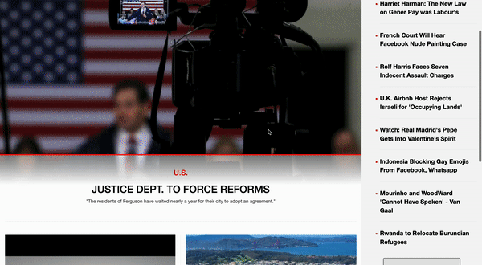

# Newsweek Clone feat. HTML, CSS, Bootstrap, and deployed on netlify

**Live Site**: https://eloquent-joliot-0aeef4.netlify.app/

**Author**: **Henry** [heinhenry@protonmail.com]

Mobile Responsive Newsweek Clone

## Motivation

Newsweek clone was an opportunity to learn about creating beautiful front-end and Mobile Responsive UI through cloning already existing websites. It is to solidify HTML, CSS, and Bootstrap via project based learning.

## Technology

   

* **HTML5**: Markup language for front-end UI development
* **CSS**: Style sheet language for presentation of front-end UI development
* **Bootstrap**: Mobile first front-end CSS Framework
* **Netlify**: Cloud based hosting this website

## Features

### Mobile Responsive Design

